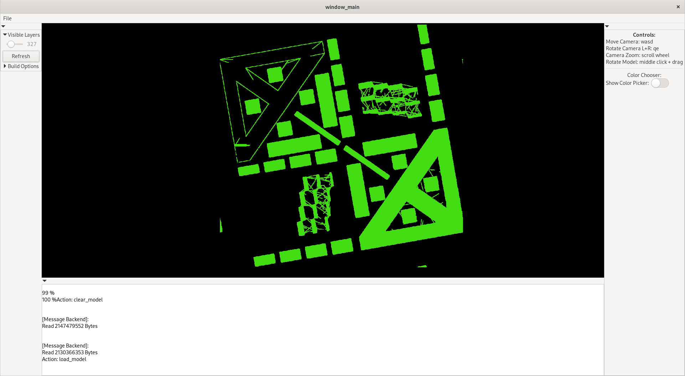
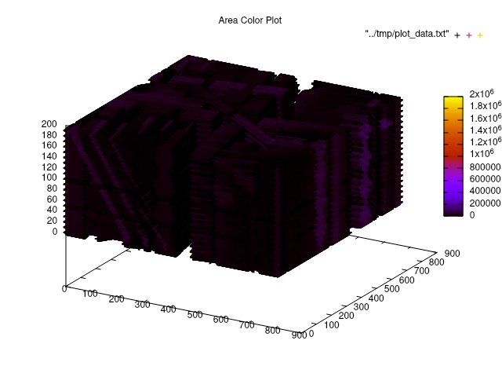

## GUI_STAT -- Graphical User Application
For Visualization of 3D Printer Sensor Data in 3D space. A Wrapper for Part_Stat.  

#### Minimum Requirements:  
In order to use this program, you must also have `OpenGL`, `glad` - the open source OpenGL loader, and `gtk3` installed on your system. Because this is a wrapper for the `part_stat` backend, you must satisfy all of the `part_stat` system requirements as well and have it installed in the same parent directory.

## Part_Stat -- Terminal Application  
For Visualization of 3D Printer Sensor Data in 3D space  

#### Minimum Requirements:  
In order to use this software, you must be on a Linux computer with the packages `gnuplot` and `libconfig` installed via your operating system's package manager. This repository contains a copy of `libtdms`. See [https://iondev.ro/tdms/](https://iondev.ro/tdms/) for more information.

#### Using the Program:
To compile this program, change into the downloaded repository's root directory and type:  
`>> make`  

This will create two programs:  
`part_stat` and `tdms_readlayer`

To run the program type the following command in the terminal:  
`>> ./part_stat`  
Note:  
This program reads from `stdin`, so you may find it desireable to take advantage of the terminal's `<` function:  
`>> ./part_stat < script.txt`  

#### Setting the Program's Configuration:  
In the repository's root directory, there is a file called `SETTINGS.cfg`. This file is used to set the programs internal variables.

`MODEL_MEM_SIZE_GB`: the total memory in GB occupied by the internal 3D model built from sensor data. Program will use this number to automatically back-calculate the correct `X_DIM`, `Y_DIM`, and `Z_DIM` values to meet this condition.  
`X_DIM`: If set to a positive integer, will override the previous `MODEL_MEM_SIZE_GB` calculation.  
`Y_DIM`: If set to a positive integer, will override the previous `MODEL_MEM_SIZE_GB` calculation.  
`Z_DIM`: If set to a positive integer, will override the previous `MODEL_MEM_SIZE_GB` calculation.  

`SHM_KEY`: Shared Memory Key, used by the operating system. Can be set to random number. Must be unique. Don't touch without reason.  

`MAX_THREAD`: Defines the maximum number of processes that will be forked when the `build_model` function is called during runtime.  

`NUM_SLICES`: Tells the program how many TDMS slices it should  expect from the user's specified sensor directory.  

#### Program Functionality:  
The program comes with a number of internal functions accessible by a terminal interactive prompt:  

`refresh_values`: This function refreshes the programs internal settings based off of changes made to the `SETTINGS.cfg` file. Use discretion to the changes you make. Don't change settings related to the internal memory reserve after running `init_mem` without first restarting the program. Plotting related settings and `MAX_THREAD` are safe.  

`init_mem`: This function initializes the programs internal memory reserve for constructing its internal 3D model by asking for it from the operating system. You should not run any of the following comands without running this one first.  

`exit`: This function deallocates the memory reserved in the previous command and exits the program safely. Note, if the program exits without going through this step, the reserved memory will remain unaccessible to other programs running on your operating system.  

`zero_model`: This function initializes the internal memory reserve to an initial state (all zeros).  

`build_model`: This function forks up to `MAX_THREAD` `tdms_readlayer` processes. These processes read the `tdms` files pointed to by the working 3D printer sernsor data directory and adds the data to the programs internal 3D model. Note, each `tdms_layer` process consumes its own amount of memory. Setting `MAX_THREAD` to too high a value will cause very high memory consumption at performance cost. I recommend settings `MAX_THREAD` to a value no greater than the number of cores on your CPU. This build process will take some time.  

`save_model`: This function will save your program's 3D model to disk in a file with a size equivalent to whatever was specified by the `MODEL_MEM_SIZE_GB` setting.  

`load_model`: This function loads a particular model save file from disk into memory. This is especially helpful to bypass the excessive wait time imposed by running `build_model`.  

`plot`: This function plots the internal 3D model for visualization. See the following section for more information.  

#### Plotting:  
This program utilizes the `gnuplot` library. The plotting functionality of this program is not finished, however, given familiarity with the `gnuplot` tool, changes to `plot_utils.c`, `plotting.h`, and `manager.c` should not be hard to implement. Add your new function to the `plot_utils.c` file, add an option to `manager.c`, recompile, and you should be good to go.
